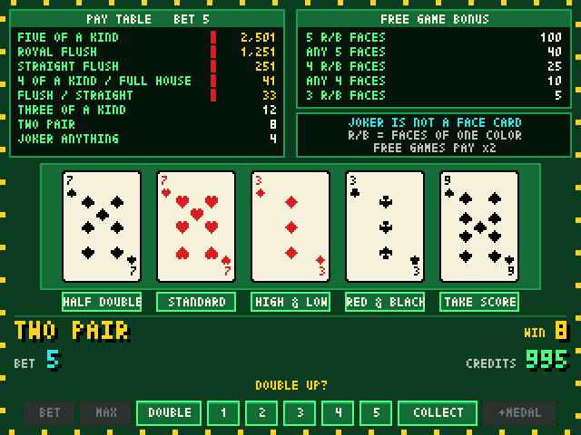
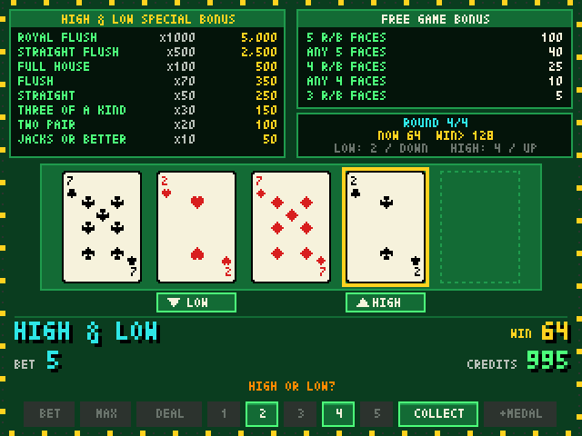

# FREE DEAL TWIN JOKERS (PROG) — retro edition

90年代のゲームセンターにあったシグマ社のビデオポーカー「52JP（緑プログレ）」を、[Pyxel](https://github.com/kitao/pyxel) で再現したレトロゲームです。
交換なしの5枚配り、ジョーカー2枚のワイルド、フリーゲーム、プログレッシブ、3種類のダブルダウン（STANDARD / HIGH & LOW / RED & BLACK）を遊べます。

> **Web 版（TypeScript + Vite + PixiJS、スマホ・PWA 対応）は [`web/`](web/README.md) にあります。** `cd web && bun install && bun run dev`

 

## 遊び方

### 必要なもの

- [uv](https://docs.astral.sh/uv/getting-started/installation/)（Python 3.13 は uv が自動で用意します）
- macOS / Windows / Linux のデスクトップ環境（Pyxel は PyPI の配布物を使うので Rust などのビルド環境は不要）

```sh
git clone git@github.com:karimatayuta/retrogame-high-and-low.git
cd retrogame-high-and-low
uv sync
uv run twinjokers        # または uv run python -m twinjokers
```

初回は CREDITS 1,000枚から始まります。最初からやり直したいときは `~/.twinjokers/save.json` を消してください。

| キー | 機能 |
|---|---|
| `B` / `M` | 1 BET / MAX BET（5枚賭けてすぐ配る） |
| `Space`・`Enter` | DEAL（BET 0 なら前回の BET で配る）／配当が出ているときはスタンダードダブル／演出の早送り |
| `1`〜`5` | HOLD 1〜5（ダブルダウンの種類・カードの選択） |
| `↑` / `↓` | HIGH & LOW の HIGH / LOW（HOLD 4 / HOLD 2 でも可） |
| `C` | COLLECT（配当を CREDITS に入れる） |
| `A` | メダルを追加 |
| `S` / `N` | スキャンライン切替 / ミュート |
| `Esc` | 終了（未精算の配当はコレクトしてから終了） |

画面下のボタンはマウスやタップでも押せます。CREDITS とプログレッシブの値は `~/.twinjokers/save.json` に保存されます（環境変数 `TWINJOKERS_SAVE` で変更可）。

## ルールの調整

仕様書で「仮」「推定」とされた値は、すべて [`src/twinjokers/domain/config.py`](src/twinjokers/domain/config.py) の `GameConfig` にあります（配当表、フリーゲーム回数、プログレ増分、HIGH & LOW の勝率 62/128 と ARCADE/FAIR モード、ボーナス倍率など）。
JSON で上書きする場合は `TWINJOKERS_CONFIG=my_config.json uv run twinjokers`。

- 仕様書: [.specs/game-spec.md](.specs/game-spec.md)
- 実装上の判断（仕様にない点の解釈）: [.specs/decisions.md](.specs/decisions.md)

## 開発に参加する

Clean Architecture で、依存は外から内への一方向です（[.specs/architecture.md](.specs/architecture.md)）。

```
src/twinjokers/
  domain/          ルール（純粋関数・値オブジェクト）。pyxel も random も I/O も使わない
    cards.py enums.py config.py hand.py free_game.py progressive.py payout.py
    double_down/   common.py standard.py red_black.py high_low.py
  application/     GameSession（状態機械）、SessionView（画面用データ）、Event、保存 Port
  infrastructure/  乱数（SystemRandom）、JSON 保存
  presentation/    Pyxel の描画・入力・音・演出（ルールは持たない）
  __main__.py      組み立て（Composition Root）
```

- 「ルールを変える」→ domain、「操作の流れを変える」→ application、「見た目・音を変える」→ presentation。
- 層をまたぐ禁止 import は `tests/test_architecture.py` が検出します。

```sh
uv run pytest            # 通常テスト（数秒）
uv run pytest -m slow    # 全 3,162,510 手の列挙検算（役の通り数・フリーゲーム条件・RTP 92.24%）
uv run ruff check && uv run ruff format --check
```

### デバッグ用の環境変数

| 変数 | 内容 |
|---|---|
| `TWINJOKERS_HEADLESS=1` | ウィンドウなしで実行 |
| `TWINJOKERS_AUTOQUIT_FRAMES=N` / `TWINJOKERS_SCREENSHOT=path.png` | N フレームで終了、終了時にスクリーンショット |
| `TWINJOKERS_AUTOPLAY=1` / `chaos` | 自動プレイ / ランダム連打 |
| `TWINJOKERS_DEBUG_SCENE=win\|standard\|redblack\|highlow\|joker\|freegame\|jackpot` | 指定場面を再現（保存しない） |
| `uv run python -m twinjokers.presentation.demo_gallery` | カード・文字・効果音のギャラリー |

### 作業の流れ

1. `develop` からブランチを切る（例: `feature/high-low-sound`）。
2. 変更する層を決め、テストを先に書く（ルールの変更なら `tests/domain/`）。
3. `uv run ruff format && uv run ruff check && uv run pytest` が通ることを確認する。ルールを変えたら `uv run pytest -m slow` も。
4. 仕様にない解釈をしたら [.specs/decisions.md](.specs/decisions.md) に1行追記する。
5. `develop` 向けに Pull Request を出す。

実機の画像・音・ロゴは使っていません。カード、文字、効果音はすべてコードで自作しています。
