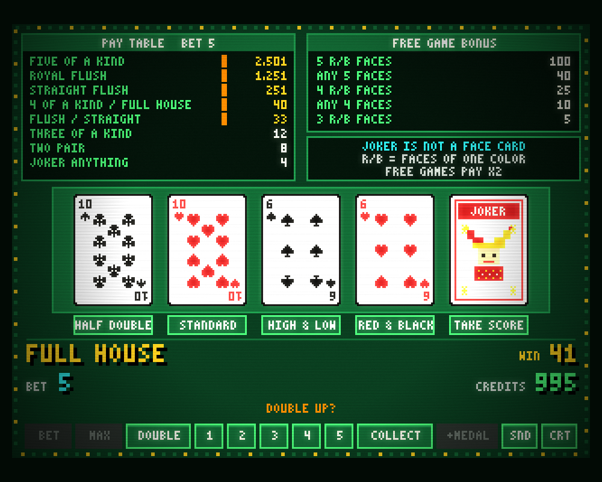

# FREE DEAL TWIN JOKERS (PROG)

90年代のゲームセンターにあったシグマ社のビデオポーカー「FREE DEAL TWIN JOKERS (PROG)」（通称 52JP、緑プログレ）を、ブラウザとスマホで遊べるように再現したレトロゲームです。



| HIGH & LOW | フリーゲーム |
|---|---|
|  |  |

- 交換なしの5枚配り、ジョーカー2枚入り
- 絵札が揃うと始まるフリーゲーム、MAX BET で積み上がるプログレッシブ
- 3種類のダブルダウン（スタンダード、HIGH & LOW、RED & BLACK）
- スマホのホーム画面に追加すれば、オフラインでも遊べます（PWA）

## すぐに遊ぶ

[Bun](https://bun.sh/) 1.3 以上が必要です。

```sh
bun install
bun run dev          # http://localhost:5173 を開く
```

CREDITS 1,000枚から始まります。CREDITS とプログレッシブの値はブラウザに保存され、次に開いたときに引き継がれます。メダルが足りなくなったら `+MEDAL` で100枚追加できます。

## 遊び方

### 1. 賭けて配る

`BET` で1〜5枚賭けて `DEAL` を押すと、5枚が配られます。**交換はなく、配られた5枚だけで役が決まります。** `MAX` は5枚賭けてすぐに配ります。

| 役 | 成立条件 | 1〜4 BET | 5 BET（MAX） |
|---|---|---|---|
| FIVE OF A KIND | 同じ数字4枚＋ジョーカー など | BET×500 | プログレッシブ |
| ROYAL FLUSH | 同じスートの 10-J-Q-K-A | BET×250 | プログレッシブ |
| STRAIGHT FLUSH | 同じスートの連番5枚 | BET×50 | プログレッシブ |
| 4 OF A KIND / FULL HOUSE | 同じ数字4枚、または3枚＋2枚 | BET×10 | プログレッシブ |
| FLUSH / STRAIGHT | 同じスート5枚、または連番5枚 | BET×8 | プログレッシブ |
| THREE OF A KIND | 同じ数字3枚 | BET×3 | 12 |
| TWO PAIR | ペア2組 | BET×2 | 8 |
| JOKER ANYTHING | ジョーカーを含み、上の役がない | BET×1 | 4 |

- ジョーカーは何にでもなります。ワンペアは役になりません。
- **プログレッシブ**：MAX BET で遊ぶたびに、STRAIGHT 以上の5つの役の配当（画面左上）が少しずつ増えていきます。当てるとその役だけ初期値に戻ります。

### 2. フリーゲーム

配られた5枚に絵札（J・Q・K）が3枚以上あると、BET なしでゲームが自動で続きます。

| 条件 | 回数 |
|---|---|
| 同じ色の絵札5枚（5 R/B FACES） | 100 |
| 絵札5枚（ANY 5 FACES） | 40 |
| 同じ色の絵札4枚（4 R/B FACES） | 25 |
| 絵札4枚（ANY 4 FACES） | 10 |
| 同じ色の絵札3枚（3 R/B FACES） | 5 |

フリーゲーム中は配当が2倍で、役がなくても毎回 BET 枚数分もらえます。ジョーカーは絵札の代わりになりません。

### 3. ダブルダウン

配当が出ると、画面下に5つの項目が並びます。`1`〜`5` で選ぶと配当を倍にする勝負ができ、`COLLECT` で配当を CREDITS に入れて終わります。

| ボタン | 項目 | 内容 |
|---|---|---|
| `1` | HALF DOUBLE | オン／オフの切替。オンにしてからスタンダードか RED & BLACK を選ぶと、配当の半分を確保して残り半分で勝負する |
| `2` / `DOUBLE` | STANDARD | 伏せた4枚から1枚選び、左端のディーラーより強ければ勝ち（同じ数字はやり直し） |
| `3` | HIGH & LOW | 次のカードが強いか弱いかを最大4回当てる。4連勝で16倍＋5枚の役に応じたボーナス |
| `4` | RED & BLACK | ディーラーと同じ色のカードを選べば勝ち。5枚がフラッシュなら計10倍 |
| `5` | TAKE SCORE | 配当を受け取って終わる |

- 外れると配当は0枚になります。
- 配当が5,001枚以上になるとダブルダウンできず、自動で精算されます（上限1万枚）。
- HIGH & LOW では同じ数字は負け、ジョーカーが出たらその場で勝ち確定です。

## 操作

画面下のボタンをタップするか、キーボードで操作します。演出中はどこを押しても早送りします。押せないボタンは暗く表示されます。

| キー | 画面のボタン | 機能 |
|---|---|---|
| `B` / `M` | BET / MAX | 1枚賭ける / 5枚賭けてすぐ配る |
| `Space`・`Enter` | DEAL / DOUBLE / NEXT | 配る（BET 0 なら前回の BET）／配当があればスタンダードダブル／フリーゲームを進める |
| `1`〜`5` | 1〜5 | ダブルダウンの種類やカードを選ぶ |
| `↑` / `↓` | 4 / 2 | HIGH & LOW の HIGH / LOW |
| `C` | COLLECT | 配当を CREDITS に入れる |
| `A` | +MEDAL | メダルを追加 |
| `S` / `N` | CRT / SND | ブラウン管風フィルターの切替 / ミュート |

## 開発者向け

### コマンド

```sh
bun run dev          # 開発サーバー（/gallery.html で部品ギャラリー）
bun run check        # 型チェック + ESLint + ユニットテスト
bun run test:slow    # 全 3,162,510 手の列挙検算（役の通り数・フリーゲーム条件・RTP 92.24%）
bun run smoke        # ブラウザで自動プレイ 20 秒（コンソールエラーで失敗）
bun run build        # 本番ビルド（dist/、PWA 込み）
bun run pwa:check    # 本番ビルドをオフラインで起動できるか確認
bun run icons        # PWA アイコンをコードから再生成
```

画面確認用の URL パラメータ:

| パラメータ | 内容 |
|---|---|
| `?seed=N` | 乱数を固定（保存しない） |
| `?autoplay=1` | 自動プレイ |
| `?scene=win\|standard\|redblack\|highlow\|freegame\|jackpot` | その場面まで自動で進める |

### 構成

TypeScript + Vite + PixiJS で作り、Clean Architecture で層を分けています。依存は外から内への一方向です。

```
src/
  domain/          ルール（役判定、配当、フリーゲーム、プログレ、ダブルダウン）。描画や乱数 API に依存しない
  application/     XState の状態機械（gameMachine）、画面用データ（toView）、ファサード（gameSession）、保存 Port
  infrastructure/  crypto 乱数、localStorage 保存
  presentation/    PixiJS 描画、GSAP 演出、Howler 効果音、入力（ルールは持たない）
  main.ts          組み立て（Composition Root）
```

- 「ルールを変える」→ `domain`、「操作の流れを変える」→ `application`、「見た目・音を変える」→ `presentation`。
- 層をまたぐ import は ESLint と `tests/architecture.test.ts` が検出します。
- 状態遷移図は [`src/application/gameMachine.ts`](src/application/gameMachine.ts) の先頭コメントにあります。

### ルールの値を変える

配当表、フリーゲーム回数、プログレ増分、HIGH & LOW の勝率（62/128）と抽選モード、ボーナス倍率など、ルールの数値はすべて [`src/domain/config.ts`](src/domain/config.ts) にあります。`defineConfig({...})` で一部だけ上書きでき、不正な値は起動時にエラーになります。

### テスト

- `bun run test:slow`：全 3,162,510 手を列挙し、役の通り数と RTP を仕様と照合します。
- `tests/review/differential.test.ts`：旧 Pyxel 版で記録したトレース（150 セッション × 400 操作）と全ステップ一致するかを確認します。記録元は削除済みでフィクスチャは再生成できないため、ルールを意図して変えてこのテストが落ちたら、更新か廃止かを明示的に判断してください。
- `tests/application/sessionFuzz.test.ts`：ランダム操作 1 万回 × 複数シードで、メダルの帳尻と状態の整合を確認します。

### 作業の流れ

1. ブランチを切る（例: `feature/high-low-sound`）。
2. 変更する層を決め、テストを先に書く。
3. `bun run check` を通す。ルールを変えたら `bun run test:slow`、画面を変えたら `bun run smoke` も。
4. 仕様にない解釈をしたら [.specs/decisions.md](.specs/decisions.md) に1行追記する。
5. Pull Request を出す。

### ドキュメント

| ファイル | 内容 |
|---|---|
| [.specs/game-spec.md](.specs/game-spec.md) | 仕様書（各項目に 確認済／推定／仮 のラベル付き） |
| [.specs/architecture.md](.specs/architecture.md) | 設計 |
| [.specs/session-design.md](.specs/session-design.md) | ゲームセッションの設計 |
| [.specs/decisions.md](.specs/decisions.md) | 仕様にない点の判断記録 |
| [.specs/todo.md](.specs/todo.md) | TODO と論点 |
| [AGENTS.md](AGENTS.md) | AI コーディングエージェント向けの指針 |

## 権利について

実機の画像・音・ロゴは使っていません。カード、ドット文字、効果音、アイコンはすべてコードで生成しています。
