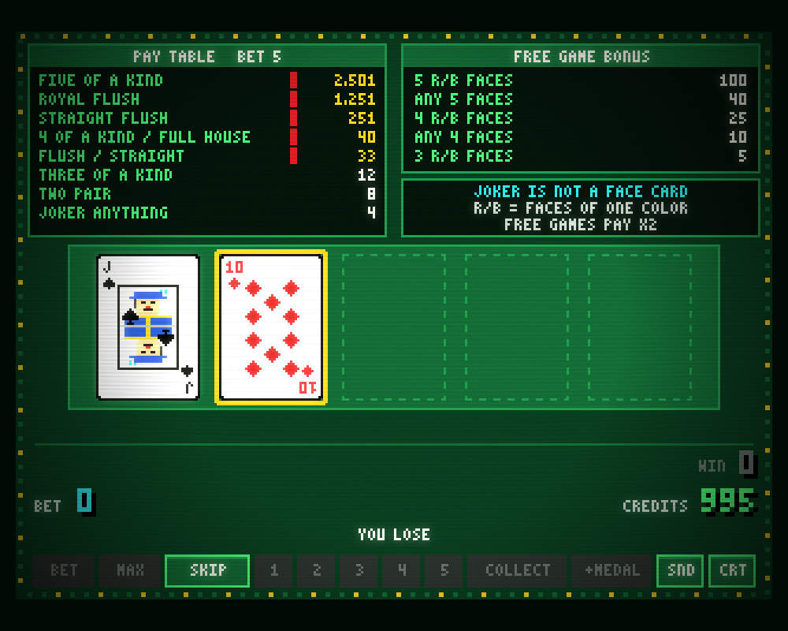
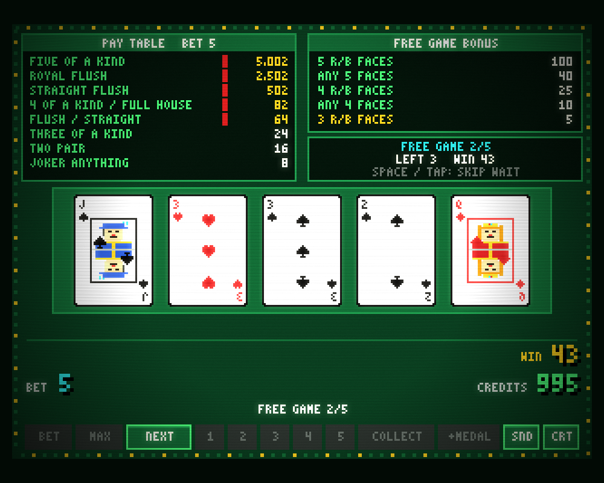

# FREE DEAL TWIN JOKERS (PROG) — Web 版

90年代のゲームセンターにあったシグマ社のビデオポーカー「52JP（緑プログレ）」を、ブラウザとスマホで遊べるようにしたレトロゲームです。
**TypeScript + Vite + PixiJS** で描画し、ルールは描画から切り離した素の TypeScript で書いています。Pyxel 版（リポジトリ直下）と同じルールで、同じ結果になることをテストで確かめています。


| | |
|---|---|
|  |  |

## 遊び方

必要なもの: [Bun](https://bun.sh/) 1.3 以上（パッケージ管理とスクリプト実行に使います。Vite・Vitest は Bun 経由で起動します）

```sh
cd web
bun install
bun run dev          # http://localhost:5173
```

CREDITS 1,000枚から始まります。CREDITS とプログレッシブの値はブラウザ（localStorage）に保存されます。スマホではホーム画面に追加すると、オフラインでもアプリのように遊べます（PWA）。

| キー | 画面のボタン | 機能 |
|---|---|---|
| `B` / `M` | BET / MAX | 1 BET / MAX BET（5枚賭けてすぐ配る） |
| `Space`・`Enter` | DEAL / DOUBLE / NEXT | 配る（BET 0 なら前回の BET）／配当が出ているときはスタンダードダブル／フリーゲームを進める |
| `1`〜`5` | 1〜5 | HOLD 1〜5（ダブルダウンの種類・カードの選択） |
| `↑` / `↓` | 4 / 2 | HIGH & LOW の HIGH / LOW |
| `C` | COLLECT | 配当を CREDITS に入れる |
| `A` | +MEDAL | メダルを追加 |
| `S` / `N` | CRT / SND | ブラウン管風フィルターの切替 / ミュート |

演出中はどのキー（タップ）でも早送りします。押せないボタンは暗く表示されます。

### デバッグ用の URL パラメータ

| パラメータ | 内容 |
|---|---|
| `?seed=N` | 乱数を固定（保存しない） |
| `?autoplay=1` | 自動プレイ |
| `?scene=win\|standard\|redblack\|highlow\|freegame\|jackpot` | その場面まで自動で進める |
| `/gallery.html` | カード・ドット文字・効果音・CRT の部品ギャラリー（開発サーバーのみ） |

## ルールの調整

仕様書で「仮」「推定」とされた値は、すべて [`src/domain/config.ts`](src/domain/config.ts) にあります（配当表、フリーゲーム回数、プログレ増分、HIGH & LOW の勝率 62/128 と ARCADE/FAIR モード、ボーナス倍率など）。`defineConfig({...})` で一部だけ上書きでき、不正な値は起動時にエラーになります。

- 仕様書: [../.specs/game-spec.md](../.specs/game-spec.md)
- 設計: [../.specs/web-architecture.md](../.specs/web-architecture.md)
- 実装上の判断: [../.specs/decisions.md](../.specs/decisions.md)（D15 以降が Web 版）

## 開発に参加する

Clean Architecture で、依存は外から内への一方向です。

```
src/
  domain/          ルール（純粋 TS）。pixi も xstate も Math.random も DOM も使わない
    cards enums config random hand freeGame progressive payout
    doubleDown/    common standard redBlack highLow
  application/     XState の状態機械（gameMachine）、画面用データ（toView）、イベント、ファサード（gameSession）、保存 Port
  infrastructure/  crypto 乱数、localStorage 保存
  presentation/    PixiJS 描画、GSAP 演出、Howler 効果音、入力（ルールは持たない）
  main.ts          組み立て（Composition Root）
```

- 「ルールを変える」→ `domain`、「操作の流れを変える」→ `application`、「見た目・音を変える」→ `presentation`。
- 層をまたぐ import は ESLint と `tests/architecture.test.ts` が検出します。
- 状態遷移図は [`src/application/gameMachine.ts`](src/application/gameMachine.ts) の先頭コメントにあります。

```sh
bun run check        # 型チェック + ESLint + ユニットテスト
bun run test:slow    # 全 3,162,510 手の列挙検算（役の通り数・フリーゲーム条件・RTP 92.24%）
bun run smoke        # ブラウザで自動プレイ 20 秒（コンソールエラーで失敗）
bun run build        # 本番ビルド（dist/、PWA 込み）
bun run icons        # PWA アイコンをコードから再生成
bun run pwa:check    # 本番ビルドをオフラインで起動できるか確認
```

テストの見どころ:

- `tests/review/differential.test.ts`：Python（Pyxel 版）と TS に同じ乱数列を与え、150 セッション × 400 操作でイベントと画面データが全ステップ一致することを確認。Python 側のルールを変えたら `uv run python web/tests/review/fixtures/gen_trace.py 150 400` で再生成します。
- `tests/application/sessionFuzz.test.ts`：ランダム操作 1 万回 × 複数シードでメダルの帳尻と状態の整合を確認。

### 作業の流れ

1. ブランチを切る（例: `feature/high-low-sound`）。
2. 変更する層を決め、テストを先に書く。
3. `bun run check` が通ることを確認する。ルールを変えたら `bun run test:slow` も。
4. 仕様にない解釈をしたら [../.specs/decisions.md](../.specs/decisions.md) に1行追記する。
5. Pull Request を出す。

実機の画像・音・ロゴは使っていません。カード、文字、効果音、アイコンはすべてコードで自作しています。
